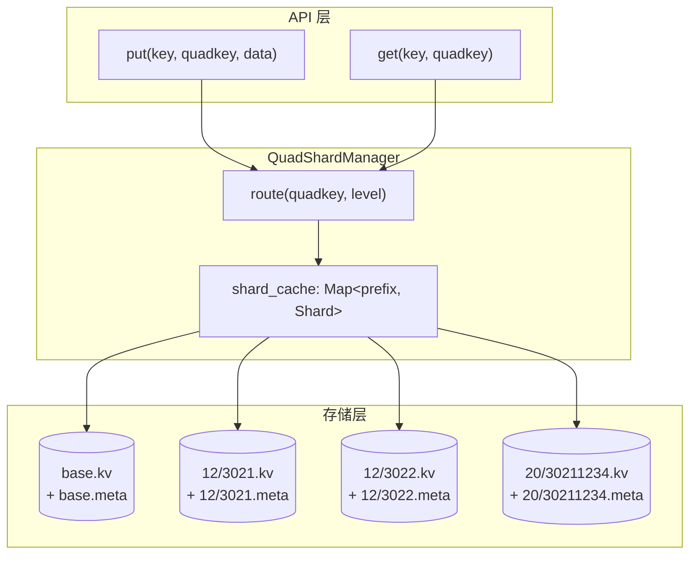

# QuadKey 分片存储设计

> 状态: 设计完成，待用户审阅
> 日期: 2026-06-21
> 替代: 现有 `ShardManager` 的固定分片模式

## 动机

当前 `ShardManager` 使用固定数量的分片 + `seahash(key) % N` 路由，存在以下局限：
1. 分片数启动时固定，无法动态扩缩
2. 数据按哈希分散，不保留空间局部性（同区域数据可能在不同分片）
3. 分片数变化时全量数据重分布

QuadKey 分片方案利用数据自带的 quadkey 编码，实现**确定性前缀匹配路由**，相同 quadkey 前缀的数据自然汇聚到同一 DB 文件。

## 核心规则

| 规则 | 说明 |
|------|------|
| 分片键 | 数据自带的 `quadkey: String` |

| DB 命名 | `level ≤ 8 → "base"`; `8 < level < 18 → quadkey[..4]`; `level ≥ 18 → quadkey[..8]` |
| 路径模板 | `{data_dir}/{data_type}/{level}/{prefix}.{ext}` — data_type **可配置**，非固定值 |
| 阈值 8/18 | **可配置** |
| DB 创建 | 首次写入时自动创建（lazy open） |
| 扩缩 | 天然支持——不同 quadkey 自动路由到不同 DB |


## 路径示例

```
示例 data_type = "tiles":

层级 5,  quadkey = "30211"
  → quad_data/tiles/base.kv
  → quad_data/tiles/base.meta

层级 12, quadkey = "302112345678"
  → quad_data/tiles/12/3021.kv
  → quad_data/tiles/12/3021.meta

层级 20, quadkey = "30211234567890123456"
  → quad_data/tiles/20/30211234.kv
  → quad_data/tiles/20/30211234.meta

示例 data_type = "objects":

层级 5,  quadkey = "30211"
  → quad_data/objects/base.kv
  → quad_data/objects/base.meta
```

## 架构



## 路由算法

```
fn route(quadkey: &str, level: u32) -> (db_name, db_path):
    db_name = match level:
        level ≤ BASE_LEVEL  → "base"
        level < SPLIT_LEVEL → quadkey[..4]
        level ≥ SPLIT_LEVEL → quadkey[..8]

    db_dir  = if level ≤ BASE_LEVEL { "{data_dir}/{data_type}" }
              else                  { "{data_dir}/{data_type}/{level}" }
    kv_path  = "{db_dir}/{db_name}.kv"
    meta_path = "{db_dir}/{db_name}.meta"
    return (db_name, kv_path, meta_path)
```

## 配置

```yaml
quad_shard:
  # 层级 ≤ base_level 时，所有数据存入 base DB
  base_level: 8
  # 层级阈值：8 < level < split_level 用 4 位前缀，≥ split_level 用 8 位
  split_level: 18
  # 数据根目录
  data_dir: "quad_data"
  # 数据类型子目录（不同数据类型隔离）
  data_type: "objects"
  # KV 数据库扩展名
  kv_ext: ".kv"
  # Meta 数据库扩展名
  meta_ext: ".db"
  # 每个 shard 的 LRU 缓存大小
  cache_size: 10000
  # 刷盘间隔（毫秒）
  flush_interval_ms: 5
```

## API 设计

### gRPC 接口 — 全部 3 个 Service

#### StoreService（客户端 → Master）

| 方法 | 请求字段 | quadkey | 说明 |
|------|---------|:------:|------|
| `Put` | key, value, content_type, tags, **quadkey, level** | ✅ 新增 | 非空→QuadKey路由；空→哈希路由 |
| `Get` | key, **quadkey, level** | ✅ 新增 | 同上 |
| `Delete` | key, **quadkey, level** | ✅ 新增 | 同上 |
| `Exists` | key, **quadkey, level** | ✅ 新增 | 同上 |
| `List` | prefix, limit, **quadkey, level** | ✅ 新增 | 非空→只查对应分片 |
| `PutBatch` | items[]每条含 **quadkey, level** | ✅ 新增 | 混合路由，按条判断 |

#### MasterService（Worker → Master，管理接口）

| 方法 | quadkey | 说明 |
|------|:------:|------|
| `RegisterWorker` | ❌ | Worker 注册 |
| `Heartbeat` | ❌ | 心跳上报 |
| `ListWorkers` | ❌ | 管理查询 |
| `GetRoute` | ❌ | 哈希路由查询 |

#### WorkerService（Master → Worker）

| 方法 | 请求字段 | quadkey | 说明 |
|------|---------|:------:|------|
| `Put` | key, value, content_type, tags, **quadkey, level** | ✅ 新增 | route(quadkey,level)→DB |
| `Get` | key, **quadkey, level** | ✅ 新增 | 同上 |
| `Delete` | key, **quadkey, level** | ✅ 新增 | 同上 |
| `Exists` | key, **quadkey, level** | ✅ 新增 | 同上 |
| `List` | prefix, limit, **quadkey, level** | ✅ 新增 | 同上 |
| `PutBatch` | items[]每条含 **quadkey, level** | ✅ 新增 | 同上 |

### RESTful 接口

#### Worker RESTful（数据操作）

路径模板：`/{data_type}/{key}?quadkey=&level=...` — data_type 可配置

| 方法 | 路径 | quadkey | 说明 |
|------|------|:------:|------|
| `POST` | `/{type}/{key}?quadkey=&level=&content_type=...` | ✅ 新增 | body raw bytes |
| `GET` | `/{type}/{key}?quadkey=&level=` | ✅ 新增 | JSON, value=base64 |
| `DELETE` | `/{type}/{key}?quadkey=&level=` | ✅ 新增 | — |
| `GET` | `/{type}/{key}/exists?quadkey=&level=` | ✅ 新增 | — |
| `GET` | `/{type}?prefix=&limit=&quadkey=&level=` | ✅ 新增 | 列表 |
| `POST` | `/{type}/batch` | ✅ 新增 | JSON body 每条含 quadkey |

#### Master Admin API（管理，不涉及数据路由）

| 方法 | 路径 | quadkey |
|------|------|:------:|
| `GET` | `/api/v1/overview` | ❌ |
| `GET` | `/api/v1/workers` | ❌ |
| `GET` | `/api/v1/workers/:id` | ❌ |
| `GET` | `/api/v1/logs` | ❌ |
| `GET` | `/api/v1/logs/stats` | ❌ |
| `GET` | `/api/v1/routes` | ❌ |
| `GET` | `/api/v1/health` | ❌ |

### 路由规则

```
if quadkey 为空或 level 为 0:
    → 走现有 Master Rendezvous Hashing 路由（向后兼容）
else:
    → 走 QuadKey 路由：route(quadkey, level) → DB 文件
```

## 向后兼容

- quadkey 字段为 **optional**：不传则走现有哈希路由
- 现有所有 API 签名不变，只新增字段
- 单机模式可直接使用 QuadShardManager

## 实现清单

| 优先级 | 任务 | 文件 |
|:------:|------|------|
| P0 | `QuadShardConfig` 配置结构体 | `src/config.rs` |
| P0 | `QuadShardManager` 核心逻辑 | `src/quad_shard.rs` |
| P0 | `ShardStrategy::QuadKey` 枚举变体 | `src/shard.rs` |
| P1 | Worker 集成：通过 quadkey 读写 | `src/worker.rs` |
| P1 | 配置 YAML 支持 | `config.yaml` |
| P2 | 单元测试 | `src/quad_shard.rs` |

## 风险

| 风险 | 缓解 |
|------|------|
| DB 文件数量膨胀（每个 quadkey 前缀一个文件） | quadkey 前缀合并保证有限集（4位=65536, 8位=1.6亿理论上界） |
| 首次写入时延迟（需要创建 DB 文件） | lazy open 开销在毫秒级 |
| quadkey 为空或非法 | 返回 `InvalidArgument` 错误 |
