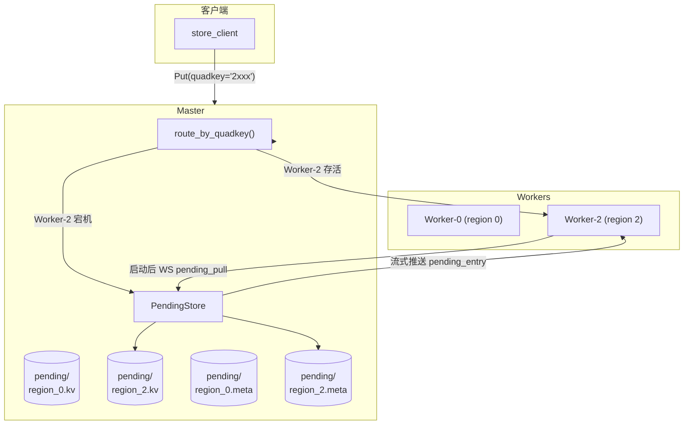

# Master Pending Cache — 区域写缓存兜底设计

> 状态: 设计完成，待实现
> 日期: 2026-06-22
> 补充: QuadKey 分片设计中 `put_via_quadkey` 路径的容错缺口

## 动机

当前 `MasterStoreService::put_via_quadkey` 使用 `route_by_quadkey` 严格按 quadkey 首字符路由到对应 region Worker。当该 Worker 宕机时，`route_by_quadkey` 返回错误，写入直接失败——没有降级/兜底机制。

本设计为 quadkey 区域路由补齐三层容错（最终采用 Layer 3 方案）：

```
Layer 1: Worker 正常      → 直写对应 region Worker（区域路由）
Layer 2: Worker 宕机      → （本设计不做跨 Worker 副本，简化）
Layer 3: 全部 Worker 宕机 → Master 本地持久化缓存，恢复后写回
```

核心思路：**放弃跨 Worker 副本复杂度，聚焦 Master 本地 pending 缓存**，覆盖 1~4 个 Worker 宕机的全部场景。

## 数据模型

Master 本地新增 `PendingStore`，按 region 分 DB 文件：

```
master_data/
├── master.db              # 现有：Worker 注册信息
├── master_logs.db         # 现有：日志
├── pending/
│   ├── region_0.kv        # region 0 宕机期间的写入（jammdb）
│   ├── region_0.meta      # region 0 元数据 (SQLite)
│   ├── region_1.kv
│   ├── region_1.meta
│   ├── region_2.kv
│   ├── region_2.meta
│   ├── region_3.kv
│   └── region_3.meta
```

### KV 存储 (jammdb)

每个 region 一个 KV 文件。key 为客户端原始 key，value 为原始 bytes。

### Meta 存储 (SQLite)

```sql
CREATE TABLE IF NOT EXISTS pending_entries (
    key        TEXT PRIMARY KEY,
    size       INTEGER NOT NULL,
    created_at TEXT NOT NULL,
    status     TEXT NOT NULL DEFAULT 'pending',
    attempt    INTEGER NOT NULL DEFAULT 0,
    updated_at TEXT NOT NULL
);
```

状态流转：

```
pending → flushing → done (惰性 GC 删除)
              ↓ (超时/失败)
           pending (attempt++)
```

- `pending`: 待写回，Worker 恢复后可拉取
- `flushing`: 正在通过 WebSocket 流推送给 Worker
- `done`: Worker 已确认写入，下一轮 GC 清理

### 自动创建

首次写入某个 region 时 lazy open 对应的 KV + Meta 文件。

## 写路径

修改 `MasterStoreService::put_via_quadkey`：

```
1. route_by_quadkey(quadkey) → 找到存活 Worker
   ├─ 成功 → 正常代理写入 Worker，返回 PutResponse { meta: Some(...) }
   └─ 失败 → 降级到步骤 2

2. 降级: PendingStore.put(region, key, value)
   ├─ 写 jammdb KV
   ├─ 写 SQLite pending_entries (status='pending')
   ├─ 同步刷盘（flush_interval_ms 5ms）
   └─ 返回 PutResponse { meta: None }
```

- 不延时、不排队：每次 put 直接落盘
- 返回 `meta: None`：客户端可据此区分正常写入和降级写入
- region 之间完全隔离：Worker-2 宕机只影响 region 2 的 pending 文件

## 读路径

修改 `MasterStoreService::get_via_quadkey`：

```
1. route_by_quadkey(quadkey) → 找到存活 Worker
   ├─ 成功 → 尝试读 Worker
   │   ├─ 命中 → 返回数据
   │   └─ 未命中 → 继续步骤 2
   └─ 失败 → 继续步骤 2

2. 查 PendingStore.get(region, key)
   ├─ 命中 → 返回数据，meta: None
   └─ 未命中 → 返回 not_found
```

- Worker 优先，Pending 兜底
- 不跨 Worker 广播查询

## 恢复写回路径

### 协议

复用已有 Master Log WebSocket（端口 50053），新增消息类型。

**Worker → Master（请求拉取）**：
```json
{"type": "pending_pull", "worker_id": "worker-2", "region": "2"}
```

**Master → Worker（流式推送）**：
```json
{"type": "pending_entry", "key": "obj:abc", "value": "<base64>", "seq": 1}
{"type": "pending_end", "total": 5000}
```

**Worker → Master（逐条确认）**：
```json
{"type": "pending_ack", "key": "obj:abc", "status": "ok"}
```

### Worker 端（启动时触发）

```
Worker 启动 → 注册到 Master → 成功
  → 通过 WS 发送 pending_pull { worker_id, region }
  → 接收 pending_entry 流 → 逐条走正常 WAL 三步写入
  → 每条成功 → 发送 pending_ack { status: "ok" }
  → 收到 pending_end → 完成
```

### Master 端

```
收到 pending_pull
  → 查询 pending_entries WHERE region = ? AND status IN ('pending', 'flushing')
  → 逐条从 jammdb 读取 value
  → 标记 status = 'flushing'
  → 通过 WS 流式推送 pending_entry
  → 全部推送完毕 → 发送 pending_end

收到 pending_ack { status: "ok" }
  → 标记 status = 'done'
  → 下次 GC 周期清理（删除 KV + Meta 记录）

收到 pending_ack { status: "fail" }
  → 标记 status = 'pending', attempt++
```

### 中断处理

- 推送中途连接断开：已标记 `flushing` 的条目在超时（如 60s）后自动回退为 `pending`
- Worker 重新连接后再次发送 `pending_pull`，Master 只推送 `pending` 状态的条目
- 已 `done` 的不重复推送

### 惰性 GC

Master 后台定时任务（如每 60s）扫描所有 region 的 pending_entries：

```sql
DELETE FROM pending_entries WHERE status = 'done' AND updated_at < datetime('now', '-60 seconds');
```

同时删除 jammdb 中对应的 KV 条目。region 的 pending 文件全部清空后可删除文件。

## 架构图



## 配置

Master 配置新增可选段：

```yaml
master:
  # ...现有配置...
  
  # Pending 缓存配置（可选，使用默认值）
  pending:
    # 数据目录（默认 master_data/pending）
    data_dir: "master_data/pending"
    # 惰性 GC 间隔（秒），默认 60
    gc_interval_secs: 60
    # flushing 超时（秒），超过后回退为 pending，默认 60
    flush_timeout_secs: 60
```

## 向后兼容

- 不影响现有正常写入路径
- 不影响无 quadkey 的旧路径（Rendezvous Hashing）
- 新增 `pending` 配置段可选，不配则用默认值
- 客户端已可通过 `PutResponse.meta.is_none()` 感知降级写入

## 实现清单

| 优先级 | 任务 | 文件 |
|:------:|------|------|
| P0 | `PendingStore` 结构体（open/put/get/flush/delete） | `src/pending_store.rs` (新) |
| P0 | `PutRequest` → `put_via_quadkey` 降级逻辑 | `src/master.rs` |
| P0 | `GetRequest` → `get_via_quadkey` 降级读逻辑 | `src/master.rs` |
| P0 | WebSocket 消息类型 `pending_pull/pending_entry/pending_end/pending_ack` | `src/logger.rs` |
| P0 | Worker 启动时 `pull_pending_from_master` | `src/main.rs` |
| P1 | Master 后台 GC 任务 | `src/master.rs` |
| P1 | `flushing` 超时回退 | `src/pending_store.rs` |
| P1 | Master 配置 `pending` 段 | `src/config.rs` |
| P2 | 集成测试（宕机→pending→恢复→写回） | `client/src/bin/fault_test.rs` |
| P2 | 单元测试 | `src/pending_store.rs` |

## 风险

| 风险 | 缓解 |
|------|------|
| pending 数据量膨胀 | 按 region 隔离 + 惰性 GC 控制，后续可加 TTL |
| WS 推送大 value 内存压力 | 逐条推送，单条最多 256MB（受 max_message_size 限制） |
| Master 单点故障丢失 pending | jammdb + SQLite 落盘，Master 重启后可恢复 |
| 写回时 Worker 再次宕机 | 超时回退为 pending，Worker 再次启动后重试 |
